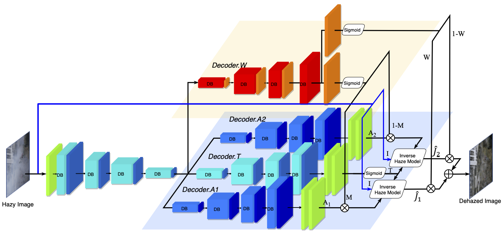
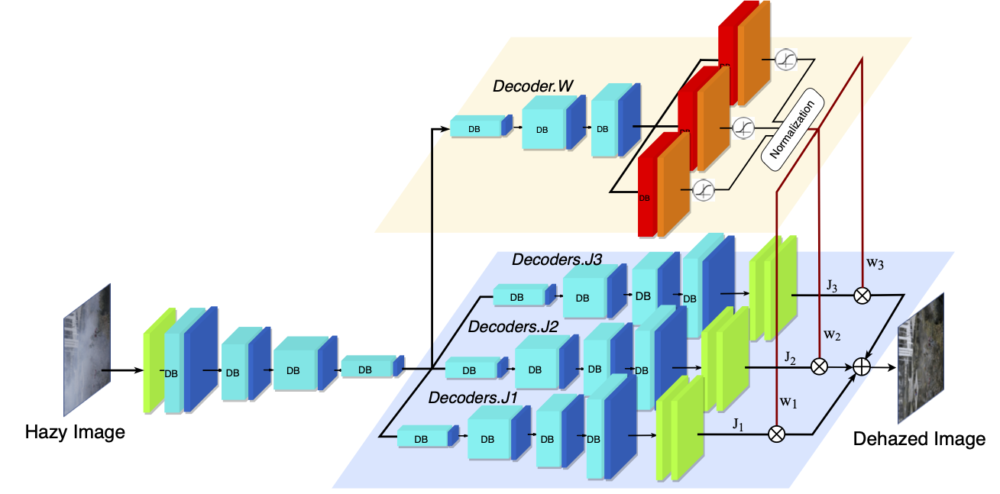

# Ensemble Dehazing Network for Non-homogeneous Haze

This repo contains codes of 3 models proposed in 2020 CVPRW paper [Ensemble Dehazing Network for Non-homogeneous Haze](http://signal.ee.psu.edu/research/EDN/EDN.pdf) **: EDN-AT, EDN-3J, EDN-EDU**. The model 'EDN-AT' is the winner of LPIPS metric in the [NTIRE 2020 Challenge on NonHomogeneous Dehazing](https://openaccess.thecvf.com/content_CVPRW_2020/html/w31/Ancuti_NTIRE_2020_Challenge_on_NonHomogeneous_Dehazing_CVPRW_2020_paper.html).

EDN-AT           |  EDN-3J
:-------------------------:|:-------------------------:
|

## Pre-request
1. Python 3.7
2. py-torch 1.0
3. openCV
4. h5py

## To evaluate the model
1. download testing images: `NH-HAZE_testHazy`
2. download related files: `dense_xxx.py`, `utils.py`, `eval_xxx.py`
2. download models from link below to the project folder
	- EDN-AT is in: https://drive.google.com/open?id=1bEhbbnoqZ4HpH1zwB33QZjYy5kJVMbO5
	- EDN-3J is in: https://drive.google.com/open?id=1tajihAfoFYAN7XoYFfjXJcY20Eww-csh
	- EDN-EDU is in: https://drive.google.com/open?id=1EKWivnW2u9Y0PZGFuavXMkvcK8bFG0Hm
3. Navigate to the downloaded folder, in terminal, type:
	`python eval_EDN_AT.py --cuda`
	
## To train the model
1. Training dataset
	- Make sure training dataset is in h5 file. 
	- Make sure input dataset is stored of size NxCxHxW under 'INPUT' dataset name and target dataset is stored of size NxCxHxW under dataset name 'TARGET'.
	- Make sure images stored in h5 file are normalized within 0 - 1.
2. download validation dataset: `NH-HAZE_validationHazy`
3. download related files: `dense_xxx.py`, `main_xxx.py`, `utils.py`, `pytorch_msssim`, `dataset.py`, `Vgg16.py`
4. Navigate to the downloaded folder, in terminal, run the main files: 
	- `python main_xxxx.py --cuda --ID name_of_the_model_to_save --traindata name_of_training_dataset.h5 --valdata NH-HAZE_validationHazy`
	

## Files
1. **dense_xxx.py**: model file which would be imported when training and testing
- dense_deep_residual_AT_adaptive.py: the network structure for our "EDN-AT" model
- dense_deep_3JW.py: the network structure for our "EDN-3J" model
- dense_deep_EDU.py: the network structure for our "EDN-EDU" model

2. **main_xxx.py**: main files for training
- main_deep_AT.py: training file for EDN-AT
- main_deep_3JW.py: training file for EDN-3J
- main_deep_EDU.py: training file for EDN-EDU

3. **eval_xxx.py**: 
The file includes test codes for our proposed network.
Parser arguments: 
	--cuda (default = store_true) for running on GPU to reproduce the submitted results,  
	--test (default="./NH-HAZE_testHazy") for the testset path.
Return: running time and the saving path for results.

4. **utils.py**: function codes that can be used through the application.

5. **pytorch_msssim**: files for calculating SSIM loss.

6. **Vgg16.py**: file for Vgg model, which is used for computing vgg loss.

7. **dataset.py**: file for loading training data to dataloader.

